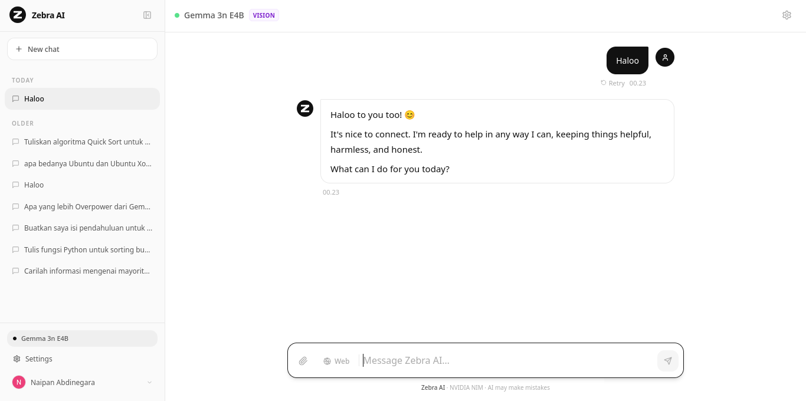
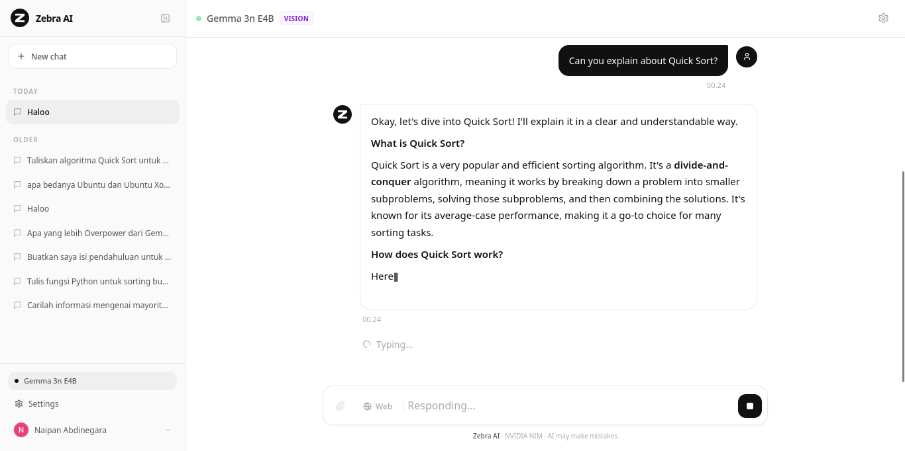

# 🚀 nvidia-chat


## 📝 Description

**nvidia-chat** is a modern web-based chat platform for high-performance AI interactions.
Built with **Next.js**, **React**, and **TypeScript**, it provides a type-safe and responsive environment.

Includes:

* Robust authentication system
* Dedicated API layer
* Clean UI for conversational AI

---

## ✨ Features

* 🌐 API integration
* 🔐 Authentication
* 🕸️ Web interface

---

## 🛠️ Tech Stack

* ⚡ Next.js
* ⚛️ React
* 📜 TypeScript

---

## ⚡ Quick Start

```bash
git clone https://github.com/NaipanAbdinegara-git/nvidia-chat.git
cd nvidia-chat
npm install
npm run dev
```

---

## 📦 Key Dependencies

```json
{
  "firebase": "^10.14.1",
  "katex": "^0.16.11",
  "lucide-react": "^0.441.0",
  "next": "14.2.5",
  "react": "^18",
  "react-dom": "^18",
  "react-markdown": "^9.0.1",
  "react-syntax-highlighter": "^15.6.1",
  "rehype-katex": "^7.0.1",
  "remark-gfm": "^4.0.0",
  "remark-math": "^6.0.0",
  "uuid": "^10.0.0"
}
```

---

## 🚀 Run Commands

* `npm run dev` → Development
* `npm run build` → Build
* `npm run start` → Production
* `npm run lint` → Lint

---

## 📸 Screenshots
<p align="center">
  
</p>

<p align="center">
  
</p>

---

## 📁 Project Structure

```bash
.
├── app
│   ├── api/chat/route.ts
│   ├── api/search/route.ts
│   ├── globals.css
│   ├── layout.tsx
│   └── page.tsx
├── components
│   ├── auth/
│   ├── ChatApp.tsx
│   ├── ChatInput.tsx
│   ├── ChatWindow.tsx
│   ├── LandingPage.tsx
│   ├── MessageBubble.tsx
│   ├── SettingsModal.tsx
│   ├── Sidebar.tsx
│   └── ZebraLogo.tsx
├── lib
│   ├── firebase.ts
│   ├── firestore.ts
│   ├── searchUtils.ts
│   ├── streaming.ts
│   └── types.ts
└── package.json
```

---

## 🛠️ Development Setup

1. Install Node.js (v18+)
2. Run:

```bash
npm install
npm run dev
```

---

## 👥 Contributing

```bash
git clone https://github.com/NaipanAbdinegara-git/nvidia-chat.git
git checkout -b feature/your-feature
git commit -m "Add feature"
git push origin feature/your-feature
```

Open a Pull Request 🚀
